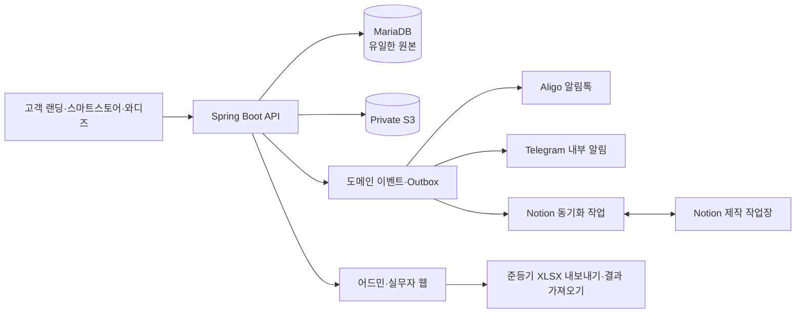

# PAW-EVER 주문·제작 운영 시스템 최종 개발 이관서

> 2026-09-12 개발용 정리본. 다운로드 원본을 보존하고 저장소에 옮겼다. 먼저 [개발 보완서](2026-09-12-development-addendum.md)를 읽는다. 기술 보완과 원문 충돌 처리 지침은 보완서를 따른다. 보완서의 Q1~Q3는 아직 답변되지 않았으며 승인된 운영 결정으로 간주하지 않는다.

작성일: 2026-09-11
대상: 백엔드·프론트엔드·인프라 개발자 및 구현을 수행하는 Codex
목적: 현재 운영 중인 주문·제작·발송 흐름을 관리자 DB 중심으로 통합하고, Notion 제작 작업장과 안전하게 연결한다.

---

## 1. 이 문서의 지위와 읽는 순서

이 문서는 개발 착수용 최종 이관서다. 세부 업무 규칙의 원본은 아래 문서다.

1. 최종 업무 규칙: `docs/superpowers/specs/2026-09-10-pawever-admin-operations-ux-design.md`
2. 최종 개발 이관 요약: 현재 문서
3. 작업 단위 구현 계획: `docs/superpowers/plans/2026-09-11-pawever-admin-notion-integration.md`
4. Notion 수정 계약: `docs/operations/2026-09-11-notion-gpt-change-request.md`
5. 팀 교육·업무 안내: 원문에서 참조한 `2026-09-11-pawever-team-role-playbook.md`는 미수령이다. 개발 보완서와 별개로 자료를 요청하며, 존재하는 파일로 간주하지 않는다.

충돌 시 우선순위는 `운영 책임자가 승인한 최신 결정 → 1번 원본 명세 → 현재 문서 → 구현 계획`이다. 구현 중 새 판단이 생기면 코드로 숨기지 말고 결정 로그에 추가한다.

## 2. 한 문장 목표

신청부터 입금, 모델링, 색상 매핑, 플레이트, 출력, 후가공, 검수, 포장, 준등기 또는 직접 수령까지 하나의 운영 화면에서 추적하되, 각 실무자는 자기 업무에 필요한 정보와 다음 행동만 보고 관리자는 병목·예외·권한·알림·삭제 복구를 한눈에 통제한다.

## 3. 현재 기준 저장소

조사 기준 시점의 저장소는 다음과 같다.

| 영역 | 저장소 | 기준 main 커밋 | 현재 스택 |
|---|---|---|---|
| 백엔드 | [OOPS-seoultech/Pawever-back](https://github.com/OOPS-seoultech/Pawever-back) | `eb4d912fe0062fdce5e335f90da7b52e86d7f6ad` | Java 17, Spring Boot 4.0.2, Spring Security, JPA, MariaDB, Flyway, AWS SDK S3 |
| 랜딩·어드민 | [OOPS-seoultech/Pawever-landing](https://github.com/OOPS-seoultech/Pawever-landing) | `26654482925b12ed262e0c1576b0adcbebf49b34` | React 19, TypeScript, Vite, Tailwind CSS 4, shadcn/Radix, Vitest, Playwright |
| 과거 앱 | `Pawever-front` | 범위 제외 | 이번 운영 시스템에서 고려하지 않음 |

개발 시작 직전에 main을 다시 받아 커밋과 최신 Flyway 번호를 확인한다. 현재 기준 마지막 migration은 `V16`이며 계획의 `V17` 이후 번호는 main이 바뀌면 충돌 없이 재번호화한다.

## 4. 현재 구현돼 있는 것

### 4.1 백엔드

- 관리자 이메일 초대, 초대 수락, 비밀번호 설정, 로그인, 계정 비활성화
- JWT 관리자 인증
- `ADMIN`, `PRODUCTION` 두 역할
- 주문 목록, 검색, 제출일·굿즈·사진 수 필터
- 주문 상세와 상태 이력
- 역할에 따른 개인정보 마스킹
- 사진 presigned URL과 ZIP 다운로드, 접근 로그
- 기본 상태 변경, 일괄 제작 시작과 되돌리기
- 수령 완료, 송장 등록, 취소
- MariaDB/Flyway와 S3 저장
- Telegram 및 Aligo 문자 연동 코드
- TossPayments 코드가 일부 남아 있음

### 4.2 프론트엔드

- 관리자 로그인과 초대 수락
- 관리자 계정 관리
- 주문 탭, 검색, 필터, 데스크톱 표와 모바일 카드
- 주문 상세 패널
- 행 단위 주요 행동과 일괄 제작 시작
- 현재 역할별 메뉴 분기

### 4.3 현재 구조의 핵심 한계

| 한계 | 영향 | 목표 |
|---|---|---|
| 주문 상태 하나에 결제·제작·배송이 섞임 | 실제 제작 병목과 배송 대기를 구분하지 못함 | order/payment/production/shipment 상태 분리 |
| 프론트와 서버에 상태 전이표가 중복 | 한쪽만 수정하면 버튼과 서버 규칙이 달라짐 | 서버가 `allowedActions` 반환 |
| 역할이 `ADMIN/PRODUCTION` 두 개뿐 | 사람별 실제 직무와 정보 접근을 표현하지 못함 | systemRole + 복수 workRole + 개인 override |
| 제작 자료와 재고가 Notion에 따로 있음 | 주문 진행과 자료 연결이 수기 | 안전한 명령형 양방향 연동 |
| 플레이트·출력·후가공이 단일 `IN_PRODUCTION` | 담당자와 단계 누락 | production task와 PrintBatch |
| 준등기 파일·결과 비교 없음 | 누락과 추가를 수기로 확인 | export snapshot + import comparison |
| 알림 발송과 상태가 체계적으로 분리되지 않음 | 중복·누락·롤백 혼선 | notification outbox와 이력 |
| 삭제·복구·롤백 사전 점검 부족 | 실수 복구가 어려움 | 관리자 휴지통, preflight, audit |

## 5. 확정된 운영 결정

1. 관리자 MariaDB가 유일한 원본이다.
2. 화면에서 `하나의 테이블`은 하나의 SQL 테이블이 아니라 하나의 통합 업무 뷰를 뜻한다.
3. 고객 사진과 제작 파일은 private S3에 두고 DB에는 object key와 메타데이터만 둔다.
4. Notion은 제작 작업장이다. 결제·배송·알림·삭제의 원본이 아니다.
5. 입금은 이종무가 은행 내역과 주문의 신청자명·입금자명을 직접 대조한다.
6. 토스페이먼츠 가입과 신규 결제 도입은 이번 범위가 아니다.
7. SLA는 결제 확인 후 영업일 기준 7일이지만 초기값은 OFF다. OWNER가 토글한다.
8. 출력·중간 확인·후가공·검수는 현재 박나혜가 수행한다.
9. 제작 보조를 채용하면 신규 작업 기본 담당자만 변경한다. 진행 중인 작업은 자동 이관하지 않는다.
10. 제작 보조 정산은 검수 통과 주문당 3,000원이며 기능 자체도 설정으로 ON/OFF 한다.
11. 고객에게 모델링 이미지를 상시 승인받지 않는다. 내부 검수 후 제작 시작 알림만 보낸다.
12. 명백한 불량은 무료 재제작 1회가 원칙이다.
13. 배송은 우체국 준등기 또는 직접 수령이다.
14. 직접 수령 장소는 상상관 또는 다빈치관이다.
15. 포장 완료 주문을 여러 건 선택하면 헤더 없는 6열 XLSX를 즉시 생성한다.
16. 우체국 반환 데이터의 준등기번호는 숫자 13자리라고 가정한다. 실제 샘플 수령 후 최종 parser를 확정한다.
17. 주문 삭제는 관리자만 가능하고 30일간 휴지통에서 복구할 수 있다.
18. 이전 단계로 롤백할 때 이미 발송된 알림톡이 있으면 사전 모달로 보여준다.
19. 관리자는 역할 기본값 위에 사람별 정보 노출과 행동 권한을 ALLOW/DENY 할 수 있다.
20. 계정은 이메일 초대로 만들고, 초대받은 사람이 24시간 내 비밀번호를 설정한다.

## 6. 시스템 경계



핵심 경계:

- 브라우저는 권한을 결정하지 않는다. 서버 응답을 표현한다.
- Notion webhook은 변경 사실만 알린다. 최신 내용을 API로 다시 읽는다.
- Notion은 직접 상태를 덮어쓰지 않고 `변경 요청`을 제출한다.
- 고객 알림은 상태 변경 트랜잭션 안에서 Aligo를 직접 호출하지 않는다.
- Telegram에는 주문번호, 가린 정보, 사진 수, 관리자 링크만 보낸다.

## 7. 도메인 상태

### 7.1 주문 상태 `orderStatus`

| 값 | 의미 |
|---|---|
| `ACTIVE` | 결제·제작·배송 중인 유효 주문 |
| `COMPLETED` | 배송 완료 또는 직접 수령 완료 |
| `CANCELED` | 취소 확정 |
| `EXPIRED` | 입금 기한 만료, 사진 파기 대상 |

### 7.2 결제 상태 `paymentStatus`

| 값 | 의미 |
|---|---|
| `PENDING` | 계좌 입금 확인 전 |
| `CONFIRMED` | 관리자가 직접 입금 확인 |
| `NOT_REQUIRED` | 무료 체험단 등 결제 없음 |
| `REFUND_PENDING` | 환불 필요 |
| `REFUNDED` | 환불 확인 |
| `FAILED` | 결제 확인 실패 |
| `EXPIRED` | 기한 만료 |

### 7.3 제작 단계 `productionStage`

```text
BLOCKED
→ MODELING_QUEUE
→ MODELING
→ MODEL_REVIEW
→ COLOR_MAPPING
→ PLATE_PREPARATION
→ PRINT_QUEUE
→ PRINTING
→ POST_PROCESSING
→ QC
→ PACKING
→ COMPLETE
```

`BLOCKED`는 결제·사진·파일·관리자 확인 문제로 다음 단계로 갈 수 없는 상태다. 실패는 단계를 임의로 뒤로 바꾸지 않고 issue와 새로운 attempt로 기록한다.

### 7.4 배송 상태 `shipmentStatus`

| 값 | 의미 |
|---|---|
| `NOT_READY` | 포장 또는 발송 준비 전 |
| `AWAITING_POST_OFFICE_RESULT` | 우체국 파일 전달 후 결과 대기 |
| `ACCEPTED` | 준등기번호 정상 반영 |
| `DELIVERED` | 배송 완료 확인 |
| `READY_FOR_PICKUP` | 지정 건물에서 직접 수령 가능 |
| `PICKED_UP` | 직접 전달 완료 |
| `EXCEPTION` | 배송 데이터 예외 |

### 7.5 이슈

이슈는 단계와 분리한다.

- `PHOTO_INSUFFICIENT`
- `PAYMENT_MISMATCH`
- `UNASSIGNED`
- `ARTIFACT_MISSING`
- `SLA_AT_RISK`
- `SLA_OVERDUE`
- `PRINT_FAILED`
- `QC_FAILED`
- `REMAKE_REQUIRED`
- `SHIPMENT_IMPORT_ERROR`
- `NOTIFICATION_FAILED`
- `NOTION_SYNC_ERROR`
- `NOTION_SYNC_CONFLICT`
- `CUSTOMER_CONTACT_REQUIRED`

상태는 `OPEN`, `RESOLVED`, `DISMISSED`다. 차단 이슈가 열려 있으면 서버가 다음 행동을 닫는다.

## 8. 역할과 권한

### 8.1 역할 모델

`systemRole`은 시스템 책임, `workRole`은 실제 작업, `permission override`는 사람별 예외다.

System roles:

- `OWNER`
- `ADMIN`
- `PRODUCTION`
- `MARKETING`
- `SUPPORT`

Work roles:

- `MODELING`
- `DESIGN_QC`
- `PRINT_FINISHING`
- `PACKING_SHIPPING`

계산 순서:

1. systemRole 기본 권한
2. workRole 합집합
3. 계정별 ALLOW/DENY
4. 동일 permission에 ALLOW와 DENY가 함께 있으면 DENY 우선
5. 만료된 override는 무시
6. 서버에서 행·필드·행동별로 검사

### 8.2 초기 계정

| 사람 | systemRole | workRole | 핵심 권한 |
|---|---|---|---|
| 이종무 | OWNER | PACKING_SHIPPING | 전체 관리, 입금, 권한, 포장·발송·복구 |
| 박신형 | PRODUCTION | MODELING | 사진·모델 자료, 모델링 작업 |
| 박나혜 | PRODUCTION | DESIGN_QC, PRINT_FINISHING | 모델 검수, 색상, 플레이트, 출력, 후가공, QC |
| 박선아 | MARKETING | 없음 | 동의 기반 마케팅 대상과 집계만 |
| 황성욱 | SUPPORT | 없음 | 시스템 상태·오류·식별자, PII 기본 차단 |
| 제작 보조 | PRODUCTION | PRINT_FINISHING | 채용 후 신규 출력·후가공·1차 검수 |

### 8.3 Permission key

권한 식별자는 원본 운영 명세 §5.4를 단일 기준으로 사용한다. 이 문서의 이전 별칭 목록은 중복 정의하지 않는다. Notion 운영·기술 오류 조회 등 원본에 없는 추가 항목과 이름 대응은 개발 보완서의 권한 항목을 따른다. 추가 키를 정의하는 것이 새로운 계정 권한 부여를 뜻하지 않는다.

개인정보 값이 허용되지 않은 계정에는 `null` 또는 필드 자체를 제외한 DTO를 내려준다. 화면 CSS로 숨기지 않는다.

## 9. 정상 운영 흐름

### 9.1 접수와 수기 입금 확인

1. 신청을 저장하고 주문번호를 생성한다.
2. 랜딩 계좌이체 주문은 `orderStatus=ACTIVE`, `paymentStatus=PENDING`이다.
3. 입금 요청 알림톡을 주문당 한 번 큐에 넣는다.
4. 이종무가 신청자명, 입금자명, 금액을 은행 내역과 직접 대조한다.
5. 일치하면 `CONFIRMED`, 확인자와 확인 시각을 저장한다.
6. 사진 수와 필수 자료를 검증한다.
7. 정상 주문은 모델링 작업을 생성하고 박신형에게 배정한다.
8. 불일치는 `PAYMENT_MISMATCH`, 자료 부족은 `PHOTO_INSUFFICIENT` 이슈를 만든다.

스마트스토어·와디즈는 추후 `salesChannel`과 외부 주문 ID로 들어오되, 이번 구현에서 공식 API를 추정해 만들지 않는다. 파일 또는 API 샘플을 받은 후 adapter를 추가한다.

### 9.2 모델링

1. 박신형에게 결제 완료·무료 주문만 보인다.
2. 사진 3~5장과 주문번호, 반려동물 이름만 제공한다.
3. 4면도, 3D 모델 원본, STL/3MF를 private S3에 저장한다.
4. 자료 등록 후 내부 검수로 넘긴다.
5. 박나혜가 닮음, 출력 가능성, 하단 커팅, 주요 특징을 확인한다.
6. 통과하면 색상 매핑으로 이동하고 제작 시작 알림 이벤트를 생성한다.
7. 고객 모델 승인 대기와 4시간 응답 타이머는 만들지 않는다.

### 9.3 색상·플레이트

1. 박나혜가 부위별 색상과 실제 filament ID를 연결한다.
2. 단순 색상명만 기록한 것은 완료가 아니다.
3. 유사한 실제 필라멘트 조합의 주문을 하나의 PrintBatch로 묶는다.
4. 3MF/G-code와 프린터, 슬롯 매핑을 저장한다.
5. 플레이트 확정 시 모든 포함 주문을 `PRINT_QUEUE`로 이동한다.

### 9.4 출력·후가공·검수

1. 출력 시작은 PrintBatch 단위다.
2. 배치와 포함 주문을 `PRINTING`으로 이동한다.
3. 퍼지 잔여물과 중간 확인은 배치 기록으로 남긴다.
4. 성공 주문은 `POST_PROCESSING`, 실패 주문은 `PRINT_FAILED`와 새 출력 시도를 만든다.
5. 서포트 제거, 레진 경화, 표면과 눈·코를 확인한다.
6. QC 체크리스트 통과 시 `PACKING`으로 이동한다.
7. 정산 기능이 ON이고 대상자가 유급 제작 보조이면 주문당 3,000원 항목을 한 번 생성한다.

### 9.5 포장과 준등기

1. 이종무가 배송 주문을 여러 건 선택한다.
2. `선택 주문 포장 완료 및 우체국 파일 받기`를 실행한다.
3. 서버가 전체 주문을 잠그고 주소·전화·중복 배치를 검증한다.
4. 성공 시에만 포장 완료, export batch 생성, XLSX 다운로드를 수행한다.
5. 주문은 `COMPLETE + AWAITING_POST_OFFICE_RESULT`로 이동한다.
6. 우체국 반환 파일을 import한다.
7. 정상 행만 확정해 `ACCEPTED`로 이동하고 발송 알림을 큐에 넣는다.
8. 누락·추가·변경·중복·잘못된 번호는 정상 행과 분리해 고친다.
9. 배송 완료가 실제 확인된 경우만 `DELIVERED + COMPLETED`로 이동한다.

### 9.6 직접 수령

기존 장소 미기록 주문과 신규 판매 채널의 허용 범위는 개발 보완서 Q1 답변 후 반영한다. 다음 장소 규칙만으로 과거 주문을 채우지 않는다.

1. 배송 방법이 `PICKUP`이면 `SANGSANG_HALL` 또는 `DAVINCI_HALL`이 필수다.
2. 포장 완료 시 `COMPLETE + READY_FOR_PICKUP`.
3. 장소별 목록을 분리한다.
4. 실제 전달한 주문만 `PICKED_UP + COMPLETED`.
5. 송장이나 주소를 요구하지 않는다.

### 9.7 예외와 재제작

정상 흐름을 임의 롤백해 실패를 표현하지 않는다. 이슈와 attempt로 기록한다.

- 출력 실패: 새 print attempt
- QC 실패: 책임 단계와 보정 경로 기록
- 명백한 불량: 원 주문번호를 유지한 remake attempt 1
- 두 번째 무료 재제작: OWNER 승인 필수
- 추가 재료비·작업비·발송비: 원 주문의 추가 원가

## 10. 하나의 운영 테이블 UX

### 10.1 공통 원칙

- 기본 진입은 역할별 `내 작업`이다.
- 목록 한 행에 현재 상태, 차단 문제, 담당자, 기한, 다음 행동 하나를 보여준다.
- 정상 처리는 목록에서 끝낸다. 상세 패널은 파일·메모·이력·예외 수정에만 쓴다.
- 상세를 닫아도 탭, 검색, 필터, 페이지, 선택 상태를 보존한다.
- 여러 건 작업은 체크박스와 한 번의 묶음 행동으로 처리한다.
- 행동 후 성공·건너뜀·실패를 주문번호별로 보여준다.
- 모든 버튼은 서버가 반환한 `allowedActions`로 결정한다.
- 숫자와 기한은 표에서 흔들리지 않게 tabular digits를 쓴다.
- 색상만으로 상태를 구분하지 않고 텍스트와 아이콘을 함께 쓴다.
- 모달은 Escape, 포커스 트랩·복원, 키보드 완료를 지원한다.
- 데이터 손실 가능 행동은 결과가 드러나는 동사형 버튼을 쓴다.

### 10.2 업무 뷰

| view | 주 사용자 | 포함 기준 | 기본 행동 |
|---|---|---|---|
| `PAYMENT_CHECK` | 이종무 | payment PENDING | 입금 확인 |
| `PRODUCTION_QUEUE` | 관리자 | CONFIRMED/NOT_REQUIRED + 모델링 미생성 | 모델링 배정 |
| `MY_TASKS` | 모든 실무자 | 현재 계정 미완료 task | 작업 시작·완료 |
| `IN_PRODUCTION` | 관리자 | MODELING_QUEUE~QC | 상세 진행 확인 |
| `PACKING_SHIPPING` | 이종무 | PACKING 또는 배송 결과 대기 | XLSX·결과 처리 |
| `PICKUP` | 이종무 | READY_FOR_PICKUP | 장소별 수령 완료 |
| `PROBLEM` | 관리자·담당자 | OPEN issue | 문제 해결 |
| `DONE` | 관리자 | COMPLETED | 조회 |
| `CANCELED_EXPIRED` | 관리자 | CANCELED/EXPIRED | 조회·파기 확인 |
| `TRASH` | OWNER | deletedAt 존재 | 복구·영구 파기 |

기본 정렬은 `차단 이슈 → SLA 초과 → SLA 임박 → 작업기한 → 오래된 주문`이다.

### 10.3 관리자 대시보드

한 화면에서 다음 숫자와 바로 가기를 제공한다.

- 입금 확인 대기
- 배정 없는 작업
- 단계별 제작 중
- 포장 대기
- 우체국 결과 대기
- 직접 수령 대기: 상상관/다빈치관
- 열린 차단 이슈
- 알림 실패
- Notion 동기화 오류·충돌
- SLA 임박·초과: SLA OFF면 `꺼짐` 표시
- 제작 보조 정산 미확정액: 기능 OFF면 `꺼짐` 표시

대시보드는 분석 보고서가 아니라 문제 해결 진입점이다. 숫자를 누르면 해당 필터의 통합 테이블로 이동한다.

## 11. 서버 응답과 API 원칙

### 11.1 공통 변경 규칙

모든 중요 변경은 다음을 받는다.

- `Idempotency-Key` 요청 헤더
- 현재 리소스 `version`
- 필요한 경우 변경 사유 `reason`

버전 충돌은 `409 Conflict`와 최신 요약을 반환한다. 같은 idempotency key의 성공 요청은 같은 결과를 반환한다.

### 11.2 목록 행 최소 응답

```json
{
  "orderNumber": "PE-2026-000139",
  "petName": "타지",
  "orderStatus": "ACTIVE",
  "paymentStatus": "CONFIRMED",
  "productionStage": "COLOR_MAPPING",
  "shipmentStatus": "NOT_READY",
  "assignee": { "id": 3, "name": "박나혜" },
  "dueAt": null,
  "blockingIssues": [],
  "allowedActions": ["OPEN_DETAIL", "START_TASK", "REPORT_ISSUE"],
  "version": 7
}
```

프론트는 별도 상태 전이표를 두지 않는다. `allowedActions`에 없는 버튼을 숨기고, 서버는 요청 시 권한과 현재 상태를 다시 검사한다.

### 11.3 필수 API

```text
GET  /api/admin/dashboard
GET  /api/admin/work-queues
GET  /api/admin/orders/{orderNumber}
GET  /api/admin/orders/{orderNumber}/timeline
POST /api/admin/orders/{orderNumber}/payments/confirm
POST /api/admin/orders/{orderNumber}/transition-preflight
POST /api/admin/orders/{orderNumber}/transition
POST /api/admin/orders/{orderNumber}/assign
POST /api/admin/orders/{orderNumber}/trash
POST /api/admin/orders/{orderNumber}/restore
DELETE /api/admin/orders/{orderNumber}/permanent

GET  /api/production/my-tasks
POST /api/production/tasks/{taskId}/start
POST /api/production/tasks/{taskId}/complete
POST /api/production/tasks/{taskId}/report-issue
POST /api/production/print-batches
POST /api/production/print-batches/{batchId}/start
POST /api/production/print-batches/{batchId}/complete

POST /api/admin/shipments/export-batches
GET  /api/admin/shipments/export-batches/{batchId}/file
POST /api/admin/shipments/imports
GET  /api/admin/shipments/imports/{importId}/comparison
PATCH /api/admin/shipments/imports/{importId}/rows/{rowId}
POST /api/admin/shipments/imports/{importId}/reprocess
POST /api/admin/shipments/imports/{importId}/apply-matched
POST /api/admin/orders/bulk-pickup-ready
POST /api/admin/orders/{orderNumber}/pickup

GET  /api/admin/staff
POST /api/admin/staff/invitations
PATCH /api/admin/staff/{accountId}/roles
PATCH /api/admin/staff/{accountId}/permissions/{permissionKey}
POST /api/admin/staff/{accountId}/suspend
POST /api/admin/staff/{accountId}/reactivate

GET  /api/admin/settings/operations
PATCH /api/admin/settings/sla
PATCH /api/admin/settings/default-assignees
PATCH /api/admin/settings/compensation
GET  /api/admin/integrations/notion/health
POST /api/admin/integrations/notion/retry/{syncJobId}
POST /api/integrations/notion/webhooks
```

기존 `/api/admin/orders` 경로의 정상 조회 기능은 재사용한다. 구현 완료 후 쓰지 않는 coarse-status endpoint와 프론트 상태 전이표는 제거한다. 장기간 병행하는 호환 레이어를 만들지 않는다.

## 12. 데이터 모델

### 12.1 원칙

UI는 한 테이블이지만 저장소는 책임별로 분리한다. 기존 `GoodsSurveyFulfillment`에 모든 속성을 계속 추가하지 않는다.

| 테이블 | 책임 |
|---|---|
| 기존 주문/fulfillment | 주문번호, 채널, 고객 암호화 정보, 상품 스냅샷 |
| `payments` | 예상 금액·입금자명, 수기 확인, 환불 |
| `production_tasks` | 단계, 담당자, attempt, 기한, 시작·완료 |
| `production_artifacts` | private S3 key, 종류, 버전, 업로더 |
| `print_batches` | 플레이트, 프린터, 파일, 상태, 실행 시각 |
| `print_batch_items` | 배치와 주문 연결, 주문별 결과 |
| `filaments` | 실제 스풀 ID, 색상, 재질, 중량, 상태 |
| `order_filament_mappings` | 주문 부위와 실제 스풀 관계 |
| `shipments` | 방법, 장소, 상태, 준등기번호 |
| `shipment_export_batches/items` | 무헤더 XLSX와 행 스냅샷 |
| `shipment_imports/rows` | 반환 파일과 비교 결과 |
| `issues` | 문제, 책임자, 해결 |
| `notification_dispatches` | 템플릿·변수·제공자 결과·멱등 키 |
| `audit_events` | 이전값·새값·행위자·사유 |
| `operation_settings` | SLA·기본 담당자·정산 토글 |
| `work_compensations` | 작업자·주문·3,000원·정산 상태 |
| `staff_work_roles` | 계정의 복수 실무 역할 |
| `role_permissions` | 역할 기본 permission |
| `account_permission_overrides` | 사람별 ALLOW/DENY |
| `notion_page_links` | 내부 리소스와 Notion page 연결 |
| `notion_sync_jobs` | 방향·상태·버전·오류·재시도 |
| `outbox_events` | 외부 발송이 필요한 도메인 이벤트 |

### 12.2 필수 제약

- 주문번호 unique
- tracking number는 NULL 허용. 값이 있을 때만 unique이며 직접 수령에는 요구하지 않는다.
- notification idempotency key unique
- compensation `(order_id, worker_id, basis, attempt)` unique
- permission override `(account_id, permission_key)` unique
- Notion page ID unique
- sync idempotency key unique
- 주문·작업·배송·Notion link에 optimistic version
- soft delete된 주문은 기본 쿼리에서 제외

### 12.3 기존 상태 일회성 마이그레이션

아래는 기존 제안의 요약이다. 실제 이전은 개발 보완서의 상태 이전 규칙을 따른다. Q2 미답변 행은 dry run에서 확인 대상으로 출력하며 운영 상태를 임의 결정하지 않는다. 원본 명세와 이 표 중 편한 쪽을 선택해 적용하지 않는다.

| 기존 `GoodsOrderStatus` | 새 값 |
|---|---|
| `PAYMENT_PENDING` | ACTIVE + PENDING + BLOCKED |
| `PAYMENT_COMPLETED` | ACTIVE + CONFIRMED + MODELING_QUEUE |
| `LEGACY_FREE` | ACTIVE + NOT_REQUIRED + MODELING_QUEUE |
| `IN_PRODUCTION` | ACTIVE + 기존 자료를 조사해 MODELING~PACKING, 불명확하면 이슈 |
| `SHIPPED` | ACTIVE 또는 COMPLETED + COMPLETE + ACCEPTED/DELIVERED 확인 필요 |
| `PICKED_UP` | COMPLETED + COMPLETE + PICKED_UP |
| `PAYMENT_EXPIRED` | EXPIRED + EXPIRED + BLOCKED |
| `PAYMENT_FAILED` | ACTIVE 또는 CANCELED 확인 + FAILED + BLOCKED |
| `CANCELED` | CANCELED + 기존 환불 기록 기반 |
| `CANCEL_FAILED` | ACTIVE + REFUND_PENDING + BLOCKED + issue |

`IN_PRODUCTION`을 특정 상세 단계로 추정하지 않는다. migration report에 확인 대상 목록을 남긴다.

## 13. Notion 연동 계약

### 13.1 방향

Admin → Notion:

- 주문번호와 내부 ID
- 제작 단계, 담당자, 기한, 관리자 자료 링크
- 알림·동기화 결과 요약
- private S3 단기 링크 또는 관리자 인증 링크

Notion → Admin:

- 작업 메모
- 멀티뷰·모델링 파일 메타데이터
- 부위별 색상 매핑
- filament relation
- plate relation
- 명시적 `변경 요청`

금지:

- Notion 편집만으로 결제·배송·삭제·알림 발송
- Notion 상태와 Admin 상태의 최신 편집 시각 경쟁
- 공개 S3 URL
- Notion webhook 본문을 전체 데이터로 신뢰

### 13.2 기술 규칙

- Notion API header는 `Notion-Version: 2026-03-11`로 고정한다.
- Java 추가 SDK를 먼저 넣지 말고 Spring `RestClient`로 필요한 endpoint만 구현한다.
- webhook endpoint는 HTTPS 공개 경로다.
- raw request body와 `X-Notion-Signature`를 HMAC-SHA256으로 검증한다.
- 이벤트는 신호이므로 page/data source 최신값을 다시 조회한다.
- 이벤트 순서를 신뢰하지 않고 관리자 데이터 version을 비교한다.
- 같은 이벤트·변경 요청은 멱등 처리한다.
- 보수적인 요청 큐를 두고 플랜별 연결·워크스페이스 제한을 고려한다. 429/529의 `Retry-After`를 따른다. 최신 근거는 개발 보완서에 연결한다.
- 서버가 쓴 미러 필드는 명령이 아니다. `변경 요청 != 없음`인 경우만 작업한다.
- 재시도 초과는 `NOTION_SYNC_ERROR`; stale version은 `NOTION_SYNC_CONFLICT`.
- 기능 플래그 `NOTION_SYNC_ENABLED=false`로 배포하고 대조 준비 후 켠다.

Notion 공식 근거:

- [Webhooks와 서명 검증](https://developers.notion.com/reference/webhooks)
- [이벤트 전달, 순서, 재시도](https://developers.notion.com/reference/webhooks-events-delivery)
- [요청 제한](https://developers.notion.com/reference/request-limits)
- [API 버전 관리](https://developers.notion.com/reference/versioning)
- [Data source API](https://developers.notion.com/reference/retrieve-a-data-source)

Notion 공식 API에는 [보기 생성](https://developers.notion.com/reference/create-view)과 [보기 수정](https://developers.notion.com/reference/update-a-view)이 있다. 필요한 보기 기능과 연결 권한을 확인하고, 지원되지 않는 설정만 수동 작업으로 남긴다.

### 13.3 환경변수

```text
NOTION_SYNC_ENABLED=false
NOTION_ACCESS_TOKEN=<AWS secret>
NOTION_WEBHOOK_VERIFICATION_TOKEN=<AWS secret>
NOTION_ROOT_PAGE_ID=3d5f50fe-348e-8078-9b82-d7303566ce82
NOTION_PRODUCTION_DATA_SOURCE_ID=<GPT가 확인한 값>
NOTION_FILAMENT_DATA_SOURCE_ID=<GPT가 확인한 값>
NOTION_PRINT_BATCH_DATA_SOURCE_ID=<GPT가 확인한 값>
NOTION_CASE_DATA_SOURCE_ID=<GPT가 확인한 값>
```

실제 비밀값은 `.env.example`, Git, 문서, Notion에 넣지 않는다. `.env.example`에는 키 이름과 빈 값만 둔다.

## 14. 알림톡

### 14.1 발송 매트릭스

| 이벤트 | 템플릿 | 방식 |
|---|---|---|
| 랜딩 계좌이체 주문 접수 | `0903_굿즈_입금요청_알림톡` | 자동, 주문당 1회 |
| 외부 채널 선결제 주문 접수 | `0820_굿즈_신청완료_알림톡` | 자동, 입금 요청과 중복 금지 |
| 내부 모델 검수 통과 | 신규 제작 시작 안내 | 템플릿 승인 후 자동 |
| 무료·체험단 배송비 입금 확인 | `0831_배송비_입금확인_알림톡` | 조건부 |
| 지연 | `0831_제작배송지연_알림톡` | 관리자 확인 후 |
| 취소 확정 | `0820_굿즈_취소안내_알림톡` | 자동 |
| 준등기 접수 | `0820_굿즈_상품발송_알림톡` | 정상 번호 반영 후 자동 |
| 배달 완료 | `0831_배송도착_알림톡` | 실제 완료 확인 후 |

신규 제작 시작 안내가 승인되기 전에는 일반 문자나 다른 템플릿으로 우회 자동 발송하지 않는다. 이벤트는 `PENDING_TEMPLATE`로 보관하거나 기능 플래그를 OFF로 둔다.

### 14.2 Outbox

1. 도메인 변경 트랜잭션에서 `outbox_events`를 저장한다.
2. worker가 notification dispatch를 만든다.
3. 승인 템플릿의 필수 변수·길이·빈 값·줄바꿈을 검증한다.
4. Aligo 응답을 저장한다.
5. 실패는 주문 상태를 되돌리지 않고 issue를 만든다.
6. 재시도와 수동 재발송을 구분한다.
7. 재발송은 OWNER/ADMIN만 가능하고 사유가 필수다.

### 14.3 롤백 사전 점검

`transition-preflight`는 다음을 반환한다.

```json
{
  "allowed": true,
  "targetStage": "COLOR_MAPPING",
  "warnings": [
    {
      "type": "NOTIFICATION_ALREADY_SENT",
      "templateCode": "제작시작_승인코드",
      "sentAt": "2026-09-11T09:30:00+09:00",
      "message": "제작 시작 안내가 이미 발송됐습니다. 고객 재안내가 필요한지 확인하세요."
    }
  ],
  "affectedArtifacts": 0,
  "affectedBatches": 1,
  "version": 7
}
```

모달 버튼은 `이전 단계로 이동`과 `취소`다. 알림 재발송을 자동 선택하지 않는다.

## 15. 준등기 XLSX

### 15.1 내보내기

첫 행부터 데이터다. 헤더가 없다. 첫 시트 이름은 `준등기`다.

| 열 | 값 | 셀 타입 | 변환 |
|---|---|---|---|
| A | 보호자명 | 텍스트 | 원문 |
| B | 우편번호 | 텍스트 | 5자리, 앞자리 0 보존 |
| C | 주소 | 텍스트 | 기본 주소 |
| D | 이하 주소 | 텍스트 | 상세 주소 |
| E | 전화번호 | 텍스트 | 숫자만, `01000000000` |
| F | 반려동물 이름 | 텍스트 | 원문 |

주문번호는 파일에 넣지 않는다. 서버가 행 번호와 정규화한 6개 값, fingerprint, order ID를 snapshot으로 보관한다.

파일 생성 성공 전에 상태를 바꾸지 않는다. 다운로드 실패 시 동일 batch 파일을 다시 받을 수 있어야 한다.

### 15.2 가져오기 비교

반환 순서를 신뢰하지 않고 정규화된 6개 값으로 비교한다.

- `MATCHED`
- `MISSING`
- `EXTRA`
- `CHANGED`
- `AMBIGUOUS`
- `DUPLICATE_TRACKING`
- `INVALID_TRACKING`
- `ALREADY_APPLIED`

정상 행은 먼저 확정할 수 있다. 오류 행 하나가 전체를 막지 않는다. `이 행 제외`는 주문 삭제가 아니다. 주문 삭제는 별도 `휴지통으로 이동` 행동이다.

## 16. 삭제·복구·개인정보 보관

- 삭제는 soft delete다: `deletedAt`, `deletedBy`, `deleteReason`.
- 삭제 즉시 일반 목록, 작업 목록, Notion 정상 동기화에서 제외한다.
- 휴지통 조회·복구의 OWNER 전용 여부는 원본과 충돌하므로 개발 보완서 Q3 답변 후 확정한다.
- 복구 preflight는 주문번호 충돌, 종결 상태, 파일 파기 여부, 알림 이력을 확인한다.
- 30일 뒤 영구 파기 worker가 처리한다.
- 배송 완료 후 고객 연결 원본과 사진은 90일 보관 후 파기한다.
- 분쟁·재제작 건은 사건 종료 후 90일을 기준으로 한다.
- 마케팅 동의는 주문 자료 보관 근거와 분리한다.
- 파기 후 복구할 수 없는 필드는 화면에 명확히 표시한다.

## 17. SLA와 기본 담당자 설정

`operation_settings`는 버전이 있는 단일 설정 집합으로 관리한다.

```json
{
  "sla": {
    "enabled": false,
    "businessDays": 7,
    "applyToExisting": false
  },
  "defaultAssignees": {
    "MODELING": "박신형 account id",
    "DESIGN_QC": "박나혜 account id",
    "PRINT_FINISHING": "박나혜 account id",
    "PACKING_SHIPPING": "이종무 account id"
  },
  "compensation": {
    "enabled": false,
    "amountPerQcPassedOrderKrw": 3000
  }
}
```

- SLA OFF 동안 due snapshot을 소급 생성하지 않는다.
- ON 이후 새로 조건을 충족한 주문부터 적용한다.
- 기존 주문 적용은 별도 확인이 필요한 일회성 행동이다.
- 기본 담당자 변경은 신규 task에만 적용한다.
- 담당자 이관은 주문을 선택한 명시적 bulk assign으로만 한다.

## 18. 보안과 감사

- 모든 권한은 서버에서 검사한다.
- invitation token은 해시 저장, 24시간 만료, 1회 사용이다.
- 비밀번호 정책과 rate limit을 적용한다.
- presigned URL은 짧은 TTL과 `no-store`를 사용한다.
- 주소·전화·보호자명 열람, 사진 링크·ZIP 발급을 감사 로그에 남긴다.
- 결제 확인, 상태 변경, 담당자 변경, permission override, 설정 변경, export/import, 롤백, 삭제·복구, 알림 재발송, Notion 충돌 해결을 감사 로그에 남긴다.
- 감사 로그에는 이전값·새값·행위자·시각·사유·request ID를 저장한다.
- 로그와 Telegram에 원본 PII, access token, presigned URL을 남기지 않는다.

## 19. 테스트 인수 조건

### 19.1 상태·권한

- [ ] 결제 대기 주문을 제작으로 직접 이동할 수 없다.
- [ ] 결제 확인 또는 무료 주문만 모델링 task가 생긴다.
- [ ] 단계 완료 시 정확히 한 번 다음 task가 생긴다.
- [ ] 프론트 상태 전이표가 제거되고 서버 `allowedActions`만 사용한다.
- [ ] DENY override가 역할 ALLOW보다 우선한다.
- [ ] 박선아에게 비동의 고객 연락처가 내려가지 않는다.
- [ ] 황성욱에게 원본 PII가 기본적으로 내려가지 않는다.

### 19.2 실무 흐름

- [ ] 로그인 후 `내 작업`에서 첫 행동까지 상세 열기 없이 가능하다.
- [ ] 작업 완료에 필수 파일이 없으면 필요한 항목을 정확히 안내한다.
- [ ] 출력 시작 한 번으로 배치와 포함 주문이 함께 이동한다.
- [ ] 부분 출력 실패가 성공 주문을 되돌리지 않는다.
- [ ] 제작 보조 기본 담당자 변경이 진행 중 task를 옮기지 않는다.

### 19.3 알림·롤백

- [ ] 같은 이벤트 재시도에 알림은 한 번만 발송된다.
- [ ] 알림 실패가 주문 상태를 원복시키지 않는다.
- [ ] 이미 알림이 발송된 단계의 롤백 preflight에 템플릿과 시각이 표시된다.
- [ ] 입금 요청과 신청 완료가 한 주문에 중복 발송되지 않는다.

### 19.4 배송

- [ ] XLSX 첫 행이 데이터이며 A~F 여섯 열만 존재한다.
- [ ] 우편번호와 전화번호가 텍스트 셀이다.
- [ ] 전화번호에서 하이픈이 제거된다.
- [ ] 파일 생성 실패 시 어떤 주문도 결과 대기로 이동하지 않는다.
- [ ] 같은 export 요청 재시도가 새 배치를 만들지 않는다.
- [ ] 반환 행 순서가 달라도 정상 매칭된다.
- [ ] 정상·오류 행을 부분 확정할 수 있다.
- [ ] 같은 import를 재실행해도 상태와 알림이 중복되지 않는다.
- [ ] 상상관과 다빈치관 직접 수령 목록이 분리된다.

### 19.5 Notion

- [ ] 잘못된 signature webhook은 401/403으로 거절된다.
- [ ] webhook 수신 후 최신 page를 다시 읽는다.
- [ ] 서버 미러 변경만으로 상태 명령이 실행되지 않는다.
- [ ] 오래된 관리자 버전의 요청은 충돌로 남는다.
- [ ] 429 `Retry-After`를 지켜 재시도한다.
- [ ] Notion 장애가 주문·결제·배송 처리를 막지 않는다.
- [ ] Notion에 PII가 기록되지 않는다.

### 19.6 회귀

백엔드:

```bash
./gradlew test
```

프론트엔드:

```bash
pnpm test
pnpm check
pnpm build
pnpm test:e2e
```

## 20. 배포와 전환

### Milestone 1: 원본 상태와 권한

- 상태 분리 migration
- 역할·권한·개인 override
- server allowedActions
- 수기 입금 확인
- audit와 idempotency

### Milestone 2: 제작과 배송

- production task, artifact, filament, PrintBatch
- QC와 정산
- 준등기 export/import
- 직접 수령 장소
- SLA, 롤백, 휴지통

### Milestone 3: 알림과 Notion

- outbox, 승인 알림톡
- Notion 연결과 webhook
- `NOTION_SYNC_ENABLED=false`로 운영 배포
- 과거 Notion 주문번호 연결
- 7일 dual check
- 오류 0, 충돌 해결 후 ON

배포 후 기존 coarse status 코드와 프론트 전이표가 더 이상 사용되지 않으면 제거한다. 두 모델을 장기간 병행하지 않는다.

## 21. 개발 전에 필요한 외부 자료

다음 자료가 없어도 Milestone 1은 시작할 수 있다. 해당 기능 최종 완료 전에는 필요하다.

1. 우체국이 돌려주는 실제 결과 엑셀 샘플 1개
2. 신규 `제작 시작 안내` 알림톡의 승인 템플릿 코드와 확정 문구
3. 팀원별 실제 이메일
4. 제작 보조 채용 후 이름·이메일·업무 시작일
5. Notion GPT가 반환한 database/data source/property ID 표
6. Notion connection token과 webhook verification token의 AWS Secret 등록
7. 영업일 계산에서 제외할 대한민국 공휴일 데이터 소스 결정

샘플이 없는 부분을 추정 parser나 임의 템플릿으로 출시하지 않는다.

## 22. 이번 범위에서 만들지 않는 것

- Tripo API 자동 모델링
- Selenium 기반 ComfyUI/Tripo 자동 조작
- 고객 모델 사전 승인과 4시간 타이머
- 자동 은행 입금 조회
- 스마트스토어·와디즈 비공식 크롤링
- Notion을 주문 원장으로 사용하는 구조
- 공개 S3 파일 링크
- 디자인 시스템 전면 교체
- 과거 모바일 앱 연동

## 23. 개발자용 Codex 시작 프롬프트

아래 문장을 개발 저장소를 연 Codex에 전달한다.

```text
PAW-EVER 주문·제작 운영 시스템을 구현해 주세요.

먼저 docs/operations/README.md와 docs/operations/2026-09-12-development-addendum.md를 읽으세요. 그다음 아래 문서와 적용되는 AGENTS.md, 실제 코드·테스트·최신 Flyway 번호를 확인하세요. Q1~Q3 미답변은 해당 운영 전환만 보류하고 독립 작업은 계속하세요.
1. docs/superpowers/specs/2026-09-10-pawever-admin-operations-ux-design.md
2. docs/operations/2026-09-11-pawever-developer-final-handoff.md
3. docs/superpowers/plans/2026-09-11-pawever-admin-notion-integration.md
4. docs/operations/2026-09-11-notion-gpt-change-request.md

현재 main 기준에서 이미 있는 관리자 인증·목록·사진 권한·기본 상태 변경을 재사용하세요. 기능을 통째로 다시 만들지 마세요. 가장 먼저 전체 테스트를 실행해 기준선을 기록한 다음 구현 계획의 체크박스를 한 작업씩 수행하세요.

중요 규칙:
- MariaDB가 유일한 원본입니다.
- 수기 계좌이체 확인이 현재 결제 방식입니다.
- 프론트에 상태 전이 규칙을 복제하지 말고 서버 allowedActions를 사용합니다.
- 권한·PII 필터링은 서버가 강제합니다.
- Notion은 명시적 변경 요청만 서버에 보냅니다.
- 알림·Notion 호출은 outbox와 멱등 키를 사용합니다.
- 기존 데이터를 추정 마이그레이션하지 마세요.
- 우체국 반환 parser와 신규 제작 시작 알림은 실제 샘플·승인 코드가 올 때까지 feature flag OFF로 둡니다.
- 쓰이지 않는 이전 경로는 새 호환 레이어로 감싸지 말고, 사용처를 확인한 뒤 제거합니다.
- 사용자와 무관한 파일을 수정하지 마세요.

각 작업은 실패 테스트 작성 → 최소 구현 → 전체 관련 테스트 → diff 검토 → 작은 커밋 순서로 진행하세요. 완료 주장 전에 백엔드 ./gradlew test와 프론트 pnpm test, pnpm check, pnpm build를 실행하세요. e2e는 주요 흐름이 연결된 뒤 실행하세요.
```
